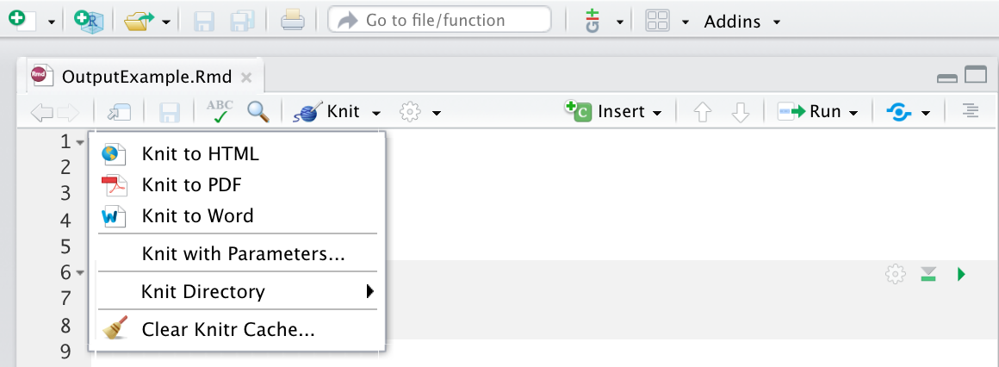

---
output: 
  html_document
--- 
# Introduction to Rmarkdown

*This chapter originated as a community contribution created by [Shaofeng](https://github.com/wsf375469088){target="_blank"}*

## 1. Overview
R Markdown provides an authoring framework for data science. You can use a single R Markdown file to both \
- **save and execute code**\
- **generate high quality reports that can be shared with an audience**\
R Markdown documents are fully reproducible and support dozens of static and dynamic output formats.\
This link provide a quick tour of what's possible with R markdown.-[links](https://vimeo.com/178485416)


### 1.1 What is R Markdown?\
- **.Rmd files**\
· An R Markdown(.Rmd) file is a record of your research. It contains the code that a scientist needs to reproduce your work along with the narration that a reader needs to understand your work.\
- **Reproducible Research**\
· At the click of a button, or the type of a command, you can rerun the code in an R Markdown file to reproduce your work and export the results as a finished report.\
- **Dynamic Documents**\
· You can choose to export the finished report in a variety of formats, including html, pdf, MS Word, or RTF documents; html or pdf based slides, Notebooks, and more.\


### 1.2 Workflow
1 **Open a new .Rmd file** at File ▶ New File ▶ R Markdown. Use the wizard that opens to prepopulate the file with a template\
2 **Write document** by editing template\
3 **Knit document** to create report; use knit button or
**render()** to knit\
4 **Preview Output** in IDE window\
5 **Publish** (optional) to web server\
6 **Examine build log** in R Markdown console\
7 **Use output file** that is saved along side .Rmd


## 2. Getting started

### 2.1. Install the package

```{r}
#install.packages('rmarkdown')
```


### 2.2. Open file

### 2.3. output format
Set the output_format argument of render to render your .Rmd file into any of R Markdown’s supported formats.For example, the code below renders OutputExample.Rmd to a Microsoft Word document. 
```{r results='hide'}
library(rmarkdown)
render("OutputExample.Rmd", output_format = "word_document")
```
**Output value table**
| output value | creates |
|--------------|---------|
| html_document| html|
| pdf_document |pdf (requires Tex )|
| word_document| Microsof Word (.docx)|
| odt_document |OpenDocument Text|
| rtf_document |Rich Text Format|
| md_document  |Markdown|
| github_document| Github compatible markdown|
| ioslides_presentation| ioslides HTML slides|
| slidy_presentation| slidy HTML slides|
| beamer_presentation| Beamer pdf slides (requires Tex) |
If you do not select a format, R Markdown renders the file to its default format, which you can set in the output field of a .Rmd file’s header. The header of 1-example.Rmd shows that it renders to an HTML file by default.

The RStudio IDE knit button renders a file to the first format listed in its output field. You can render to additional formats by clicking the dropdown menu beside the knit button:


## 3. Markdown syntax


 
 | Right | Left | Default | Center |
|------:|:-----|---------|:------:|
| 12 | 12 | 12 | 12 |
| 123 | 123 | 123 | 123 |
| 1 | 1 | 1 | 1 | 


* **plain text**    
plain text

* **italics and bold**  
```{}
*italics* and **bold**
```

*italics* and **bold**  


* **list**  
```{}
* unordered list  
   + sub-item 1  
   + sub-item 2  
   - sub-sub-item 1 
```
  
* unordered list
  + sub-item 1
  + sub-item 2
  - sub-sub-item 1 
  
```{}
1. ordered list
2. item 2  
 i) sub-item 1  
    A. sub-sub-item 1 
```
1. ordered list
2. item 2
  i) sub-item 1  
    A. sub-sub-item 1 
  
  
* **headers**
```{}
# Header1 {#anchor}
## Header 2 {#css_id}
### Header 3 {.css_class}
#### Header 4
##### Header 5
###### Header 6 
```
# Header1 {#anchor}
## Header 2 {#css_id}
### Header 3 {.css_class}
#### Header 4
##### Header 5
###### Header 6 

* **hyperlink**
```{}
<http://www.rstudio.com>
[link](www.rstudio.com)
Jump to [Header 1](#anchor) 
```
<http://www.rstudio.com>
[link](www.rstudio.com)
Jump to [Header 1](#anchor) 

* **table**
```{}
| Right | Left | Default | Center |
|------:|:-----|---------|:------:|
| 12    | 12   | 12      | 12     |
| 123   | 123  | 123     | 123    |
| 1     | 1    | 1       | 1      | 
```

 | Right | Left | Default | Center |
|------:|:-----|---------|:------:|
| 12 | 12 | 12 | 12 |
| 123 | 123 | 123 | 123 |
| 1 | 1 | 1 | 1 | 

* **equation**
```{}
$$E = mc^{2}$$ 
```
$$E = mc^{2}$$ 

## 4. Embeding code

### 4.1. Inline code

### 4.2. Code chunks

### 4.3. Display options

## 5. Rendering

* first way
* second way